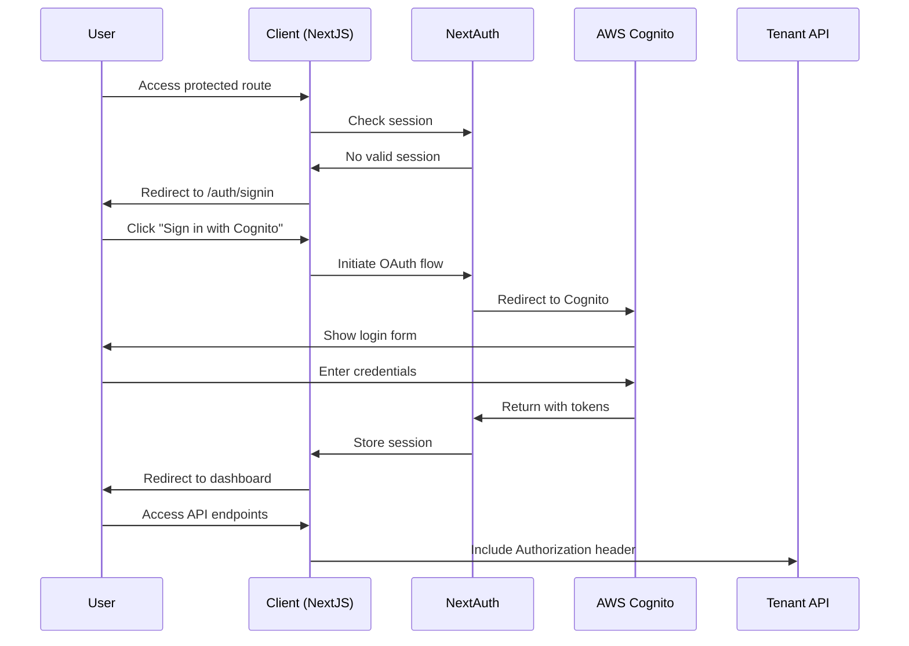

# AWS Cognito Authentication Integration

## Overview

This document describes the authentication integration for EdForge EMIS using NextAuth.js with AWS Cognito. The implementation follows enterprise-grade security practices while maintaining compatibility with the existing POC functionality.

## Architecture

### Authentication Flow



### Security Features

- **PKCE Flow**: Uses Proof Key for Code Exchange for enhanced security
- **HTTP-Only Cookies**: Tokens stored securely in HTTP-only cookies
- **Token Refresh**: Automatic token refresh before expiration
- **Tenant Isolation**: Multi-tenant support via tenantId claims
- **Server-Side Validation**: All authentication checks happen server-side

## Environment Configuration

Create a `.env.local` file with the following variables:

```env
# Cognito Configuration
NEXT_PUBLIC_CLIENT_ID=<your-cognito-client-id>
NEXT_PUBLIC_ISSUER=<your-cognito-issuer-url>
NEXT_PUBLIC_WELL_KNOWN_ENDPOINT_URL=<your-cognito-well-known-url>

# API Configuration
NEXT_PUBLIC_API_URL=<your-tenant-api-gateway-url>

# NextAuth Configuration
NEXTAUTH_SECRET=<generated-secret>
NEXTAUTH_URL=http://localhost:3000
```

### Environment Variables Reference

| Variable | Description | Example |
|----------|-------------|---------|
| `NEXT_PUBLIC_CLIENT_ID` | Cognito App Client ID | `1234567890abcdef` |
| `NEXT_PUBLIC_ISSUER` | Cognito User Pool issuer URL | `https://cognito-idp.us-east-1.amazonaws.com/us-east-1_ABC123DEF` |
| `NEXT_PUBLIC_WELL_KNOWN_ENDPOINT_URL` | Cognito OIDC discovery endpoint | `https://cognito-idp.us-east-1.amazonaws.com/us-east-1_ABC123DEF/.well-known/openid_configuration` |
| `NEXT_PUBLIC_API_URL` | Tenant API Gateway base URL | `https://api.edforge.net` |
| `NEXTAUTH_SECRET` | Secret for JWT signing | Generated 32-character string |
| `NEXTAUTH_URL` | Application base URL | `http://localhost:3000` |

## Implementation Details

### NextAuth Configuration

The NextAuth configuration (`src/app/api/auth/[...nextauth]/route.ts`) includes:

- **Cognito OIDC Provider**: Configured with PKCE flow
- **Custom Claims Extraction**: Extracts `tenantId`, `tenantTier`, `userRole` from Cognito tokens
- **Token Refresh Logic**: Handles automatic token refresh
- **Session Strategy**: JWT-based sessions with 1-hour expiration

### API Client Integration

The API client (`src/lib/api-client.ts`) provides:

- **Automatic Token Injection**: Adds `Authorization: Bearer <token>` to all requests
- **401 Handling**: Redirects to sign-in on authentication failure
- **Public Endpoint Skipping**: Skips auth for public endpoints
- **Development Logging**: Debug logging in development mode

### Route Protection

Middleware (`src/middleware.ts`) protects routes by:

- **NextAuth Integration**: Uses `withAuth` middleware
- **Route Matching**: Protects all dashboard routes
- **Public Route Allowance**: Allows access to auth pages and static assets
- **Automatic Redirects**: Redirects unauthenticated users to sign-in

## User Experience

### Sign-In Process

1. User accesses protected route
2. Redirected to `/auth/signin` if not authenticated
3. Clean, professional sign-in page with Cognito branding
4. OAuth flow handled seamlessly
5. Redirected to dashboard upon successful authentication

### Session Management

- **Persistent Sessions**: Sessions persist across browser refreshes
- **Automatic Refresh**: Tokens refresh automatically before expiration
- **Secure Storage**: All tokens stored in HTTP-only cookies
- **Sign-Out**: Complete session cleanup on sign-out

## Development Tools

### Auth Info Page

Access `/auth/info` in development mode to:

- View decoded JWT tokens
- Inspect user claims and metadata
- Check token expiration times
- Debug authentication issues

### Debug Logging

Development mode includes:

- Token refresh logging
- API request authentication logging
- Permission check logging
- Session state logging

## RBAC Status

**Current State**: RBAC functionality is temporarily disabled to allow all authenticated users access to all POC functionality.

**Future Implementation**: RBAC will be re-enabled in a future phase with proper Cognito role mapping.

### Disabled Features

- Navigation item filtering based on permissions
- Page-level permission checks
- Role-based UI element visibility
- Permission-based API access control

### Preserved Features

- User role display in UI
- Role-based color coding
- Permission type definitions
- Navigation structure

## Troubleshooting

### Common Issues

#### 1. Authentication Loop

**Symptoms**: User gets stuck in redirect loop between sign-in and dashboard

**Solutions**:
- Check `NEXTAUTH_URL` matches your application URL
- Verify Cognito client configuration
- Clear browser cookies and localStorage

#### 2. Token Refresh Failures

**Symptoms**: User gets logged out unexpectedly

**Solutions**:
- Check Cognito client refresh token configuration
- Verify `NEXT_PUBLIC_CLIENT_ID` is correct
- Check network connectivity to Cognito

#### 3. API Authentication Errors

**Symptoms**: API calls return 401 errors

**Solutions**:
- Verify `NEXT_PUBLIC_API_URL` is correct
- Check API client token injection
- Verify Cognito token has required scopes

#### 4. Environment Variable Issues

**Symptoms**: Authentication doesn't work at all

**Solutions**:
- Verify all environment variables are set
- Check `.env.local` file is in project root
- Restart development server after changes

### Debug Steps

1. **Check Session State**: Visit `/auth/info` to inspect session
2. **Verify Environment**: Ensure all required variables are set
3. **Check Network**: Monitor network requests for auth failures
4. **Review Logs**: Check browser console and server logs
5. **Test Cognito**: Verify Cognito configuration independently

## Security Considerations

### Production Deployment

- Use HTTPS in production
- Set secure cookie flags
- Implement proper CORS policies
- Use environment-specific Cognito user pools
- Enable Cognito advanced security features

### Token Security

- Tokens stored in HTTP-only cookies
- Automatic token refresh prevents exposure
- No sensitive data in client-side code
- Proper token validation on server-side

### Multi-Tenant Security

- Tenant isolation via `tenantId` claims
- API calls include tenant context
- User data scoped to tenant
- Cross-tenant access prevention

## Future Enhancements

### Planned Features

1. **Proper RBAC Implementation**
   - Cognito role mapping
   - Permission-based navigation
   - Role-specific UI elements

2. **Enhanced User Management**
   - User profile management
   - Role assignment interface
   - Multi-user scenarios

3. **Advanced Security**
   - Multi-factor authentication
   - Session management
   - Audit logging

4. **API Integration**
   - Real-time data fetching
   - CRUD operations
   - WebSocket authentication

## Support

For technical support or questions:

1. Check this documentation
2. Review NextAuth.js documentation
3. Consult AWS Cognito documentation
4. Check application logs and debug tools
5. Contact development team

---

**Last Updated**: December 2024  
**Version**: 1.0  
**Status**: Production Ready
